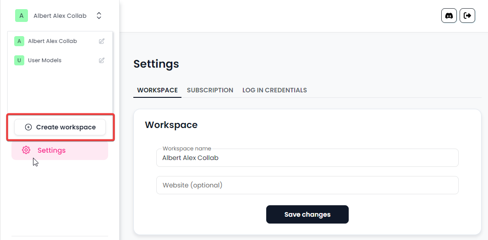
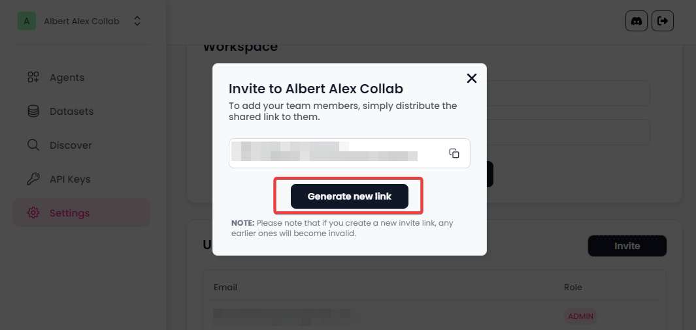

# Workspace

In Synthflow AI, workspaces act as collaborative environments where you and your team can work together on AI agents. They allow you to segregate projects, streamline collaboration, and manage permissions.

### 1. Creating a New Workspace

Workspaces enable you to organize your AI agents by projects or teams. Here's how you create a new workspace:

1. **Open the Workspaces Menu**: In the Synthflow AI platform, click the right side upper menu of the header.
2. **Click on 'Create workspace'**: Enter the name for the workspace and click 'Create'.
3. **Set Up the Workspace**: You can now start adding AI agents to this workspace, and invite team members as needed.

<figure><figcaption></figcaption></figure>

### 2. Inviting Users to a Workspace

Collaborating with your team is essential for building effective AI agents. Here's how you can invite users to a workspace:

1. **Select the Workspace**: Navigate to the workspace where you want to invite users and go to the Settings -> Workspace tab.
2. **Generate Invite Link**: Click on 'Invite Users' and you'll see an option to generate a shared link.
3. **Distribute the Link**: Share the link with the team members you want to invite. They can access the workspace by clicking on the link.
4.  **Manage Users**: You can see who has joined, and you have the option to remove users if needed.

    **NOTE**: Please note that if you create a new invite link, any earlier ones will become invalid.

<figure><figcaption></figcaption></figure>

