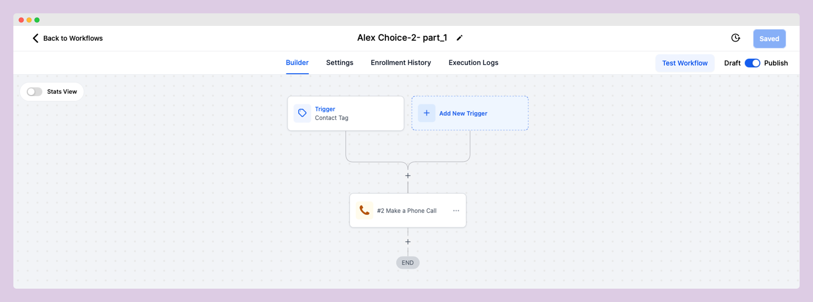
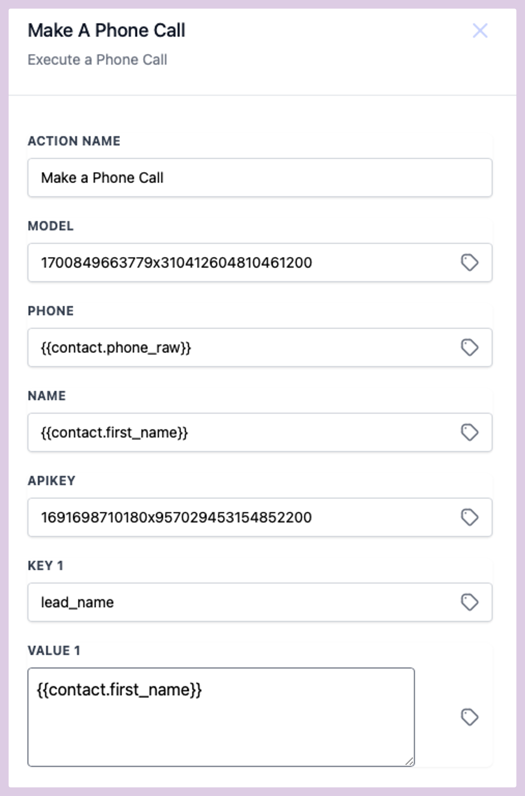
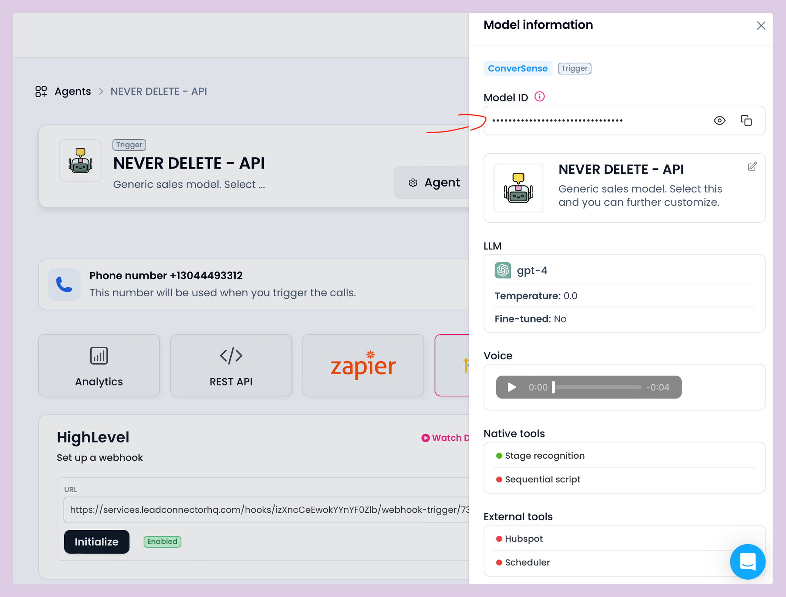
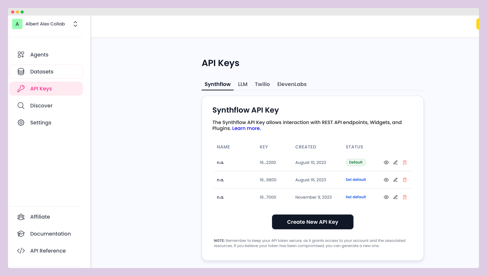
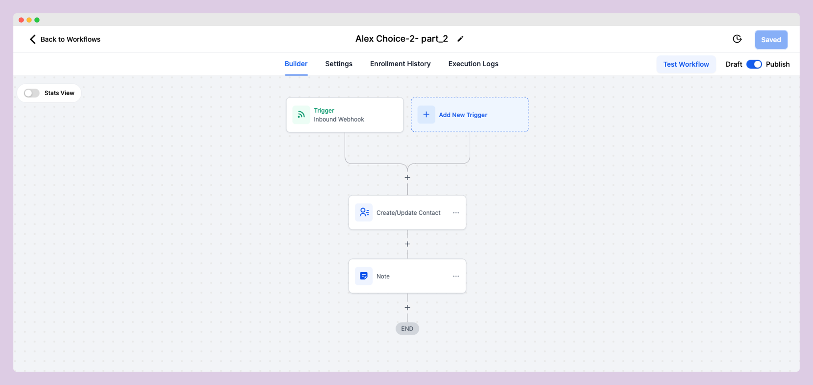
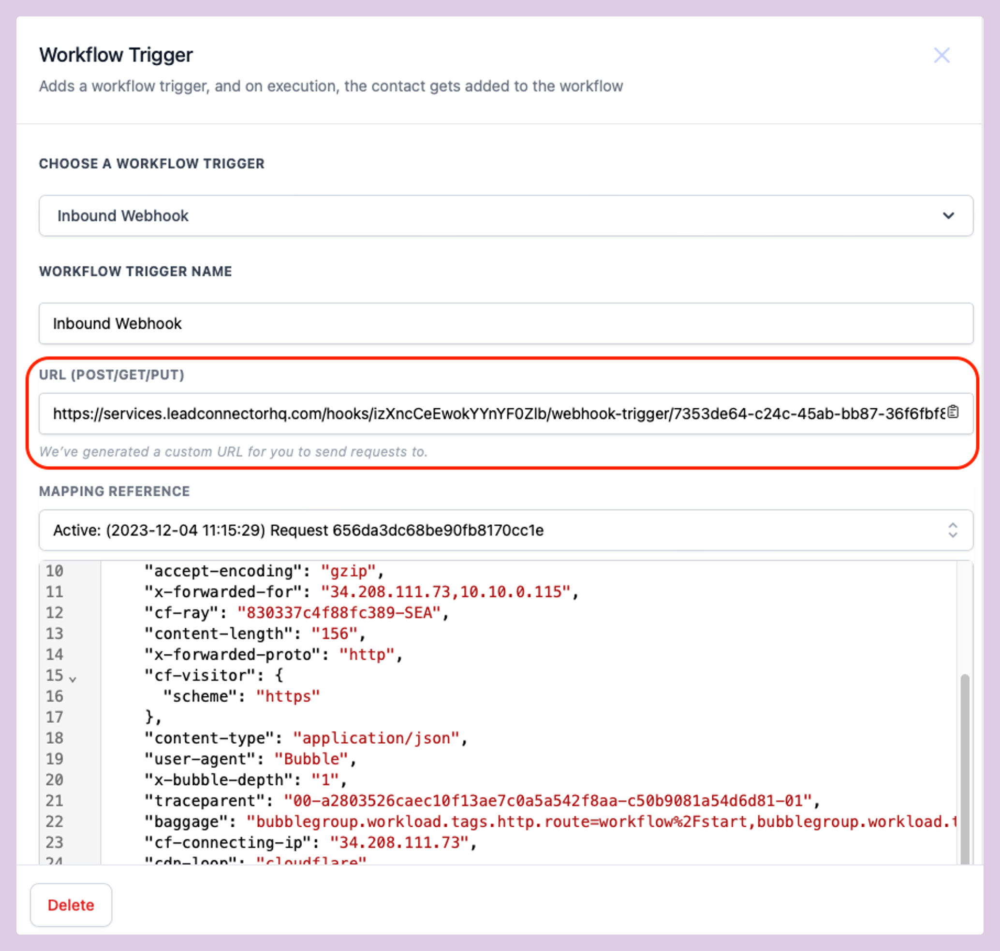
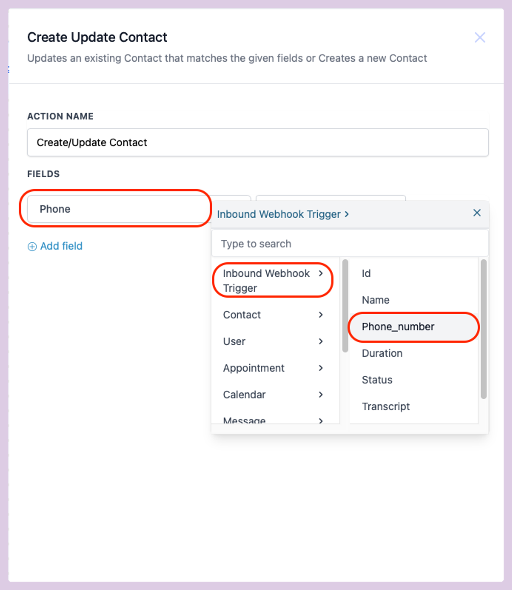
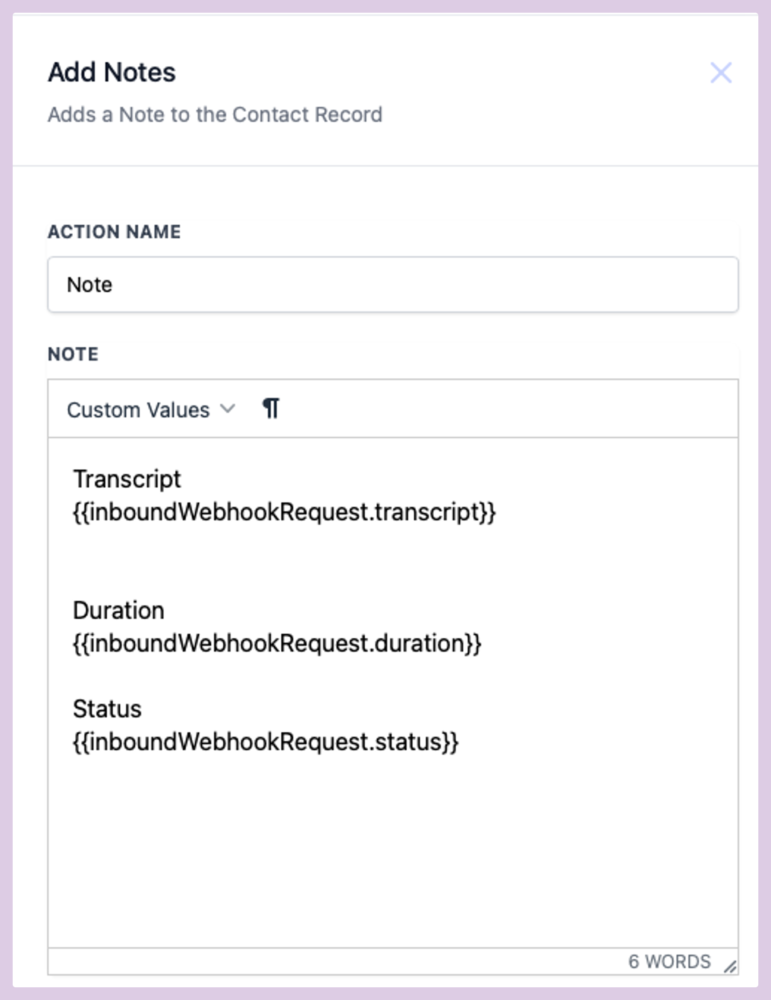
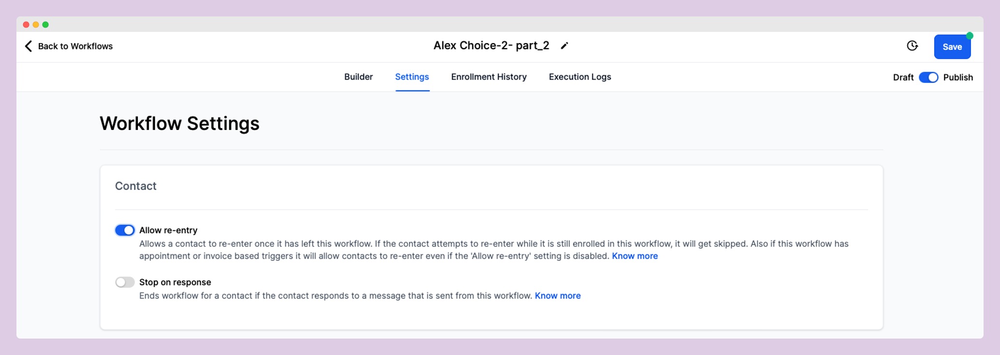

# GoHighLevel Integration

## Video


How to integrate GHL


**Marketplace Link:** [https://marketplace.gohighlevel.com/integration/653bee8ab4783e721f7b1348](https://marketplace.gohighlevel.com/integration/653bee8ab4783e721f7b1348)\
\
**Notes**

* The Synthflow App can be used for Agency and Subaccount

### **Prerequisites**:

* An active subscription with Synthflow.ai is required.
  * Register at [synthflow.ai/ghl](https://synthflow.ai/ghl).
* Generate an API-Key within your Synthflow.ai dashboard.

#### Preparing Your Assistants in Synthflow.ai

* **For Inbound Calls:** You must have an Inbound Assistant configured in Synthflow.ai.
* **For Outbound Calls:** You must set up an Outbound Workflow Assistant in Synthflow.ai.

Successfully integrating Synthflow.ai for both inbound and outbound calls within your GoHighLevel account involves creating two specific workflows: one for making calls and another for retrieving transcripts.

### Workflow #1: Make the Call

To initiate calls via Synthflow.ai, create the first workflow automation in GHL.

<figure><figcaption></figcaption></figure>

1.  **Create a Workflow Trigger:**

    * Select <mark style="background-color:orange;">“Contact Tag”</mark> as your trigger.
    * Apply filters and choose <mark style="background-color:orange;">"call"</mark>&#x20;

    

    <figure><figcaption>
Contact Tag Trigger
</figcaption></figure>

    

2.  **Configure the Call Action:**

    * Add a <mark style="background-color:orange;">"Make A Phone Call"</mark> action and select Synthflow.ai - AI Phone Assistant

    

    <figure><figcaption></figcaption></figure>

    

    * Enter the Model ID, which can be found in the Synthflow.ai app under the "More info" section.

    

    <figure><figcaption>
Model ID - Synthflow.ai App
</figcaption></figure>

    

    * Set the contact's phone number and first name fields:
      * Phone: Use the contact’s raw format phone number.
      * Name: Input the contact’s first name.
    * Insert your Synthflow.ai API key, which is available under the API tab in the Synthflow.ai app.

    

    <figure><figcaption>
API key - Synthflow.ai App
</figcaption></figure>

    

    * Map the 'lead\_name' to the contact's first name for personalization.

### Workflow #2: Retrieving the Call Transcript

To capture the call transcript, proceed with the following workflow.

<figure><figcaption>
Workflow 2 - Example
</figcaption></figure>

1.  **Set Up an Inbound Webhook Trigger:**

    * Copy the provided webhook URL (POST/GET/PUT)

    

    <figure><figcaption>
COPY URL(POST/GET/PUT)
</figcaption></figure>

    

    * Paste this URL into the Synthflow.ai web app under your Assistant’s Deployment settings for GHL, and initialize.

    

    <figure><figcaption>
PASTE URL - Synthflow.ai App
</figcaption></figure>

    

    * Select the <mark style="background-color:orange;">MAPPING REFERENCE</mark> dropdown and pick any sample request
2.  **Add Create or Update Contact Action:**

    * Use the "Create/Update Contact" action to log the phone number from the Inbound Webhook.

    

    <figure><figcaption>
CREATE UPDATE CONTACT - Phone_number
</figcaption></figure>

    

3.  **Add a Notes Action:**

    * Utilize the "Notes" action to record the call transcript, duration, and status by clicking <mark style="background-color:orange;">Custom Values > Inbound Webhook Trigger > Transcript/Duration/Status</mark>

    

    <figure><figcaption>
Notes Action
</figcaption></figure>

    

#### ! Important: Always Keep Allow re-entry enabled

<figure><figcaption></figcaption></figure>
